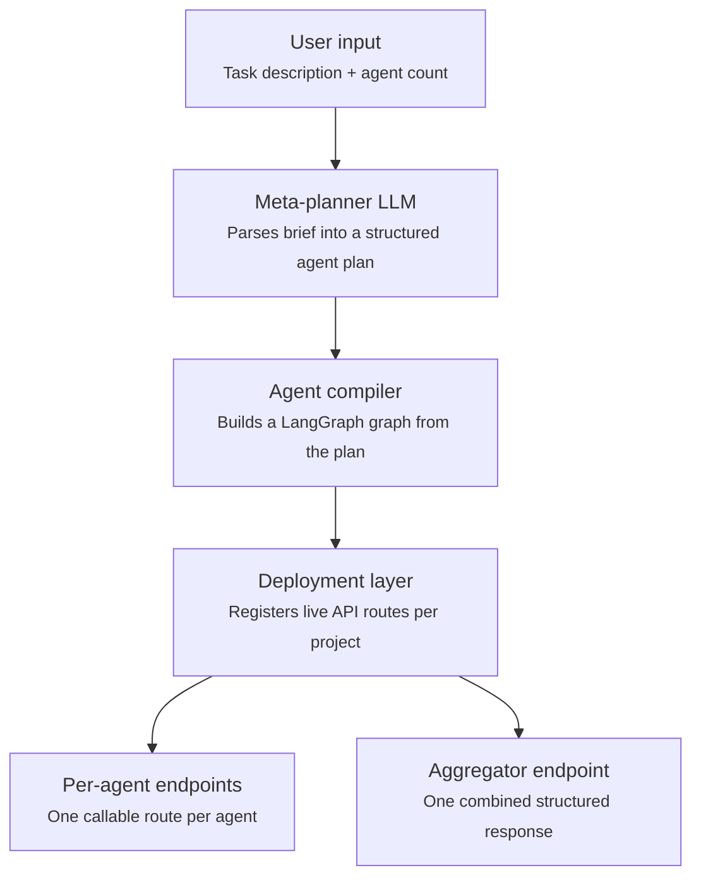

# Agentic Platform

**Natural-language multi-agent builder.** Describe a task in plain English, say how many
agents you want and what each should do, and get back live, callable API endpoints for a
compiled multi-agent system — ready to wire into your own website, app, or pipeline.

---

## Overview

Agentic Platform is a natural-language platform for designing, compiling, and deploying
multi-agent AI systems. A user describes what they want built — in plain English, no code
— states how many agents they want and what each should do, and the platform turns that
description into a working team of AI agents with live, callable API endpoints.

### Problem

Building a multi-agent AI system today means hand-writing orchestration logic, wiring up
tools, choosing and configuring models, and standing up infrastructure to serve it — even
for people who know exactly *what* they want the agents to do but don't want to own the
engineering behind *how* it runs. That gap is the entire product.

### What it does

1. The user describes their task and the agent team they want, in natural language.
2. The planning layer turns that description into a structured, validated plan: how many
   agents, each agent's job, how they're wired together (sequential, parallel, or
   supervised/routed), what tools each needs, and which LLM powers each one.
3. The user reviews and can adjust the plan — reassign a model, tweak a role, merge or
   split an agent — before anything is built.
4. The platform compiles the plan into a running multi-agent graph and deploys it,
   returning a live endpoint per agent, plus one optional combined endpoint that returns
   a single structured JSON response synthesized from the whole team.
5. The user takes those endpoints and builds whatever they want on top, without touching
   orchestration code themselves.

### Goal

Make standing up a working, production-callable multi-agent system as easy as describing
it — while keeping the underlying system safe (no arbitrary code execution from user
input), model-agnostic (any supported LLM provider, chosen per agent), and genuinely
scalable from a single hobby project to many concurrent tenants.

### Non-goals (for now)

- Not a general no-code app builder — the output is API endpoints, not a UI.
- Not a training or fine-tuning platform — it composes and serves existing foundation models.
- Not aiming for full arbitrary-code agents in v1 — agents are LLM calls plus a fixed,
  vetted set of tools, not sandboxed code-execution environments (deliberately, as a
  later, isolated feature if ever added).

---

## Architecture

A five-stage pipeline. A natural-language brief goes in one end; live, callable API
endpoints come out the other. Every stage is a clean interface boundary — the planner
never talks to infrastructure, and the compiler never talks to an LLM for planning
decisions.



**Stage walkthrough**

- **User input** — free-text task description plus a desired agent count (or "auto"),
  optionally naming preferred models per role.
- **Meta-planner LLM** — a single structured-output call that decomposes the brief into
  an `AgentPlan`: agent roles, system prompts, tool assignments, dependency wiring,
  orchestration pattern, and per-agent LLM choice.
- **Agent compiler** — a fixed, well-tested function that interprets the `AgentPlan` and
  builds a LangGraph graph. It never executes model-generated code — only model-generated
  *configuration*.
- **Deployment layer** — registers the compiled graph behind versioned, per-project API
  routes and returns their URLs plus auto-generated API docs.
- **Endpoints** — one route per agent for direct, granular access, and one optional
  aggregator route that runs the whole graph and returns a single structured response.

### Orchestration patterns

All three are first-class and chosen by the planner per project, never hardcoded to one:

| Pattern | When it's used |
|---|---|
| **Sequential** | Strict pipeline — each agent's output feeds the next (research → draft → edit). |
| **Parallel** | Independent agents run concurrently on the same input and merge at a synthesis step. |
| **Supervisor** | A router agent decides at runtime which agent acts next, looping until it signals completion — used when the brief implies conditional branching. |

---

## Technology stack

| Layer | Choice | Why |
|---|---|---|
| Agent orchestration | LangGraph | Native stateful multi-agent graphs, cycles, checkpointing |
| Agent / tool abstraction | LangChain | Unified model factory, tool interfaces, structured output |
| API layer | FastAPI | Async, dynamic routing, auto-generated OpenAPI docs |
| Primary datastore | PostgreSQL | Plans, project metadata, run history, multi-tenant keys |
| Cache / queue | Redis | Compiled-graph cache, background compilation jobs |
| Background workers | Celery / RQ | Async compilation and long-running agent executions |
| Observability | LangSmith (or equiv.) | Per-run tracing; explains why an agent produced an output |
| Isolation (scale-up path) | Modal / AWS Lambda | Promote a heavy or sensitive tenant to dedicated infra |
| Secrets management | KMS-backed encryption | BYOK provider keys encrypted at rest, decrypted only in memory |

### Supported LLM providers

Any agent's model is chosen independently through a single factory function
(`get_llm()` in `graph_builder.py`), so adding a provider never touches orchestration code.

| Provider | Notes |
|---|---|
| `openai` | Native `init_chat_model` support |
| `anthropic` | Native `init_chat_model` support |
| `google_genai` | Native `init_chat_model` support |
| `groq` | Native `init_chat_model` support |
| `moonshot` | Kimi models (e.g. `kimi-k3`) — OpenAI-compatible endpoint, wired in directly via `ChatOpenAI` against Moonshot's base URL. Reasoning effort and other quirks pass through `LLMConfig.extra_params` rather than living as dedicated schema fields. |
| `ollama` | Self-hosted / local models, no API key required |

Model choice is user-controllable at three points: named directly in the natural-language
brief, set as an explicit per-role preference, or edited manually per agent on the
plan-review screen before deployment.

---

## Project structure

```
.
├── agent_schema.py         # Pydantic contracts: LLMConfig, AgentSpec, AgentPlan
├── meta_planner_prompt.py  # Meta-planner system prompt + structured-output planner call
├── graph_builder.py        # Compiles an AgentPlan into a runnable LangGraph graph
├── README.md                # This file
└── SYSTEM_PROMPT.md         # System prompt for the engineer/agent building this project
```

---

## Getting started

```bash
pip install langchain langgraph langchain-openai langchain-anthropic \
            langchain-google-genai fastapi uvicorn pydantic

export OPENAI_API_KEY=...
export ANTHROPIC_API_KEY=...
export MOONSHOT_API_KEY=...       # for Kimi K3
export DATABASE_URL=postgresql://...
export REDIS_URL=redis://...
```

Plan a project, review the generated `AgentPlan`, then compile and deploy it:

```python
from meta_planner_prompt import plan_project
from graph_builder import compile_graph

plan = plan_project(
    user_brief="Research a topic, draft a summary, then fact-check it.",
    requested_agent_count=3,
    available_tools=["web_search"],
    available_llms=[
        {"provider": "anthropic", "model": "claude-sonnet-4-6", "tier": "balanced"},
        {"provider": "moonshot", "model": "kimi-k3", "tier": "frontier"},
    ],
)
graph = compile_graph(plan)
result = await graph.ainvoke({"input": {"topic": "..."}, "outputs": {}})
```

---

## Roadmap

| Phase | Scope | Key deliverables |
|---|---|---|
| **MVP** | Prove the core loop end to end | Meta-planner + schema; in-memory graph compile; single-process FastAPI dynamic routes; sequential orchestration only |
| **V1** | Broaden orchestration & usability | Parallel + supervisor patterns; persistence (Postgres/Redis); per-project API keys; plan-review/edit UX; synthesis (aggregate) endpoint |
| **V2** | Scale & harden | Tenant isolation for heavy users; observability dashboard; expanded tool registry; rate limiting and billing |

---

## Security notes

- No model-generated code is ever executed — only model-generated configuration,
  interpreted by a fixed compiler.
- User-supplied provider API keys are encrypted at rest and decrypted only in-memory at
  call time.
- Every agent run is bounded — enforced max steps, timeouts, token budgets, and error
  retries (see `SYSTEM_PROMPT.md`), not left to model good behavior.
- Tools with real-world side effects require explicit per-project opt-in.
