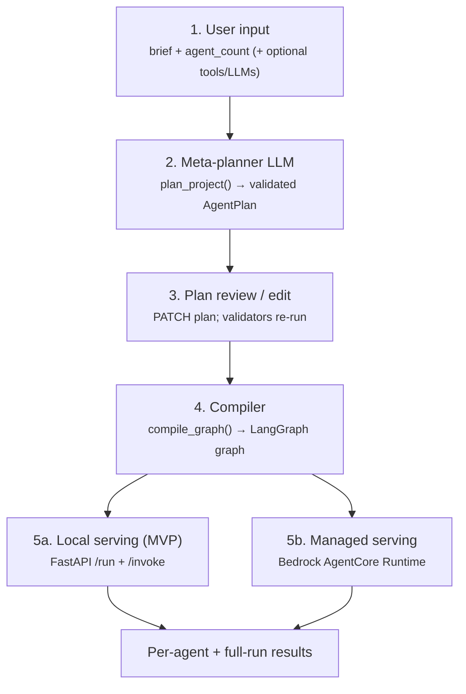
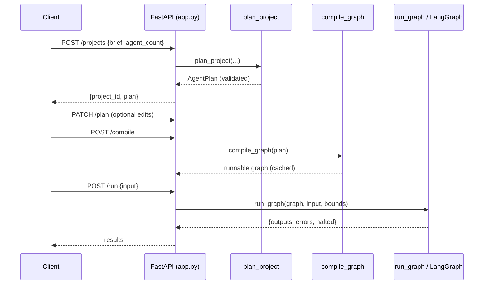
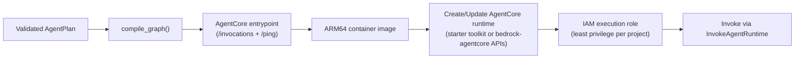

# System Flow — Agentic Platform

End-to-end reference for how a natural-language brief becomes a live, callable
multi-agent system, and how that system is served (locally via FastAPI, in production via
Amazon Bedrock AgentCore Runtime). This document is grounded in the current source
(`agent_schema.py`, `meta_planner_prompt.py`, `graph_builder.py`, `app.py`, `tools.py`,
`config.py`, `errors.py`) and is intended as the base for further, more detailed docs.

> Read alongside `README (2).md` (product/architecture narrative), `CLAUDE.md` (operating
> contract), and `SYSTEM_PROMPT.md` (builder brief). Where those describe intent, this
> describes the actual wiring as built.

---

## 1. The five stages at a glance



| Stage | Entry point | Produces | Never does |
|---|---|---|---|
| 1. Input | `POST /projects` | a `CreateProjectRequest` | trust the text as safe |
| 2. Plan | `plan_project()` | a validated `AgentPlan` | talk to infrastructure |
| 3. Edit | `PATCH /projects/{id}/plan` | a re-validated `AgentPlan` | accept invalid edits |
| 4. Compile | `compile_graph()` | a runnable LangGraph graph | call an LLM for planning |
| 5. Serve | FastAPI / AgentCore | agent outputs + errors | execute model-generated code |

**Boundary invariant:** the planner never talks to infrastructure; the compiler never
calls an LLM for planning decisions. The LLM emits only structured *configuration*
(`AgentPlan`), and a fixed compiler interprets it — model output is never executed as code.

---

## 2. Data contracts (`agent_schema.py`)

Everything downstream keys off these Pydantic models. This is the single source of truth
for what a plan is allowed to be.

- **`LLMConfig`** — `provider` (one of `openai | anthropic | google_genai | groq |
  moonshot | ollama`), `model`, `temperature`, and `extra_params` (the escape hatch for
  provider quirks, e.g. Moonshot Kimi's reasoning/sampling params — never a bespoke field
  per provider).
- **`AgentSpec`** — `id`, `role`, `system_prompt`, `llm: LLMConfig`, `tools: list[str]`,
  `depends_on: list[str]`, `output_schema` (forward-compat hook, default `"default"`).
  `id`/`role`/`system_prompt` are validated non-blank.
- **`AgentOutput`** — `content: str` + `data: dict` — the one structured shape every
  compiled agent node returns.
- **`RunBounds`** — `max_steps` (8), `timeout_s` (300.0, whole-graph wall clock),
  `max_retries` (3). Every run is bounded by these, not by model good behavior.
- **`AgentPlan`** — `agents`, `orchestration_pattern` (`sequential | parallel |
  supervisor`), `supervisor_id` (only for supervisor), `bounds`.

**`AgentPlan` model validator (`_validate_graph`) enforces, at parse time:**
1. at least one agent;
2. unique agent ids (no duplicates);
3. no agent depends on itself; every `depends_on` id is a known agent;
4. sequential/parallel plans are acyclic (`_assert_acyclic`, DFS cycle detection);
5. supervisor plans set `supervisor_id` to a real agent and have ≥1 worker besides it;
6. `supervisor_id` is set **only** for the supervisor pattern.

Because these run on parse, an invalid plan is rejected the moment it's constructed —
including on a plan edit (`PATCH`).

---

## 3. Stage 2 — planning (`meta_planner_prompt.py`)

`plan_project(user_brief, requested_agent_count, available_tools?, available_llms?,
planner_llm?)` is the only component that turns free text into a plan.

Flow:

1. Defaults resolve: `available_tools` → all `TOOL_REGISTRY` names; `available_llms` →
   `[{DEFAULT_PROVIDER, DEFAULT_MODELS[...]}]`; `planner_llm` → default provider/model.
2. `get_llm(planner_llm)` builds the chat model; `.with_structured_output(AgentPlan)`
   forces structured output.
3. Retry loop up to `_PLANNER_RETRY_CEILING` (3), `_PLANNER_BACKOFF_S` (1.0s):
   - build system + user messages (`_build_user_message` injects task, count, allowed
     tool names, allowed LLM options, and — on retry — the previous rejection reason);
   - `structured.invoke(messages)` → candidate `AgentPlan` (schema validators run here);
   - `_semantic_check(...)` re-validates server-side that every agent's tools ⊆ allowed
     set and every `(provider, model)` ⊆ allowed options (constraints the schema alone
     can't express);
   - on `ValidationError | ValueError`, capture the error text, feed it back as the
     `correction` on the next attempt (error-recovery loop applied to the planner itself).
4. On success, return the `AgentPlan`. On ceiling exhaustion, raise **`PlannerError`**
   (`attempts`, `last_error`).

**Key point:** the model's own claim that its output is well-formed is never trusted —
the plan is re-validated (schema + semantic) server-side before it can be compiled.

---

## 4. Stage 4 — compilation (`graph_builder.py`)

`compile_graph(plan)` dispatches on `orchestration_pattern`. First it fails fast: for
every agent it calls `get_tools(spec.tools)` so an unknown tool is caught at compile time,
not mid-run.

### 4.1 The LLM factory — `get_llm(config)`

Single point where a provider string becomes a `BaseChatModel`:
- `moonshot` → `ChatOpenAI` against `MOONSHOT_BASE_URL` (OpenAI-compatible), key required,
  `extra_params` passed through;
- `google_genai` → `ChatGoogleGenerativeAI`, key resolved from `GOOGLE_API_KEY` or
  `GEMINI_API_KEY`;
- native providers (`openai | anthropic | groq | ollama`) → `init_chat_model` (ollama
  needs no key);
- anything else → **`UnsupportedProviderError`**.
Missing key → **`MissingProviderKeyError`**. Adding a provider means a branch here + a
`config.py` entry — never a compiler or planner change.

### 4.2 Graph state — `GraphState` (TypedDict)

Threaded through every compiled graph:
- `input: dict` — the task input;
- `outputs: dict` — merge reducer (`{**a, **b}`) so nodes don't clobber siblings;
- `errors: list[dict]` — `operator.add` reducer (append-only structured failures);
- `halted: bool` — `operator.or_` reducer (any branch can flag failure without a write
  conflict; short-circuits the remaining sequential chain);
- `next_agent: str`, `supervisor_steps: int` — supervisor-only.

`initial_state(task_input)` seeds all of these.

### 4.3 The agent node — `_make_node(spec, bounds, include_all_outputs=False)`

Every worker node does the same thing:
1. **Dependency gating:** if any `depends_on` id is missing from `outputs`, skip and
   record a structured skip (`AgentExecutionError`, `attempts=0`) + set `halted`.
2. Build base messages: system prompt + `_build_context(...)` (task input plus the
   relevant prior outputs — declared deps normally, or *all* outputs for supervisor
   workers).
3. **Per-agent retry loop** up to `bounds.max_retries`:
   - on retry, append the actual previous error to this agent's own context (not a
     generic "try again");
   - `_run_agent_once(...)`: bounded tool loop (`bind_tools`, up to `max_steps`
     iterations, resolving tool calls via the validated tool map), then
     `.with_structured_output(AgentOutput).invoke(...)` for the final answer;
   - success → return `{"outputs": {spec.id: output}}`;
   - failure → capture error, backoff (`_NODE_BACKOFF_S`), retry.
4. Ceiling exhausted → record a structured **`AgentExecutionError`** in `errors` and set
   `halted` — never raise, so one agent's failure never crashes the whole run.

### 4.4 The three patterns

- **Sequential (`_compile_sequential`)** — `_topological_order` sorts by `depends_on`
  (stable, preserving planner order among ready nodes); nodes chain START→…→END with
  conditional edges that route to END the moment `halted` is set.
- **Parallel (`_compile_parallel`)** — wires the real dependency DAG: agents with no deps
  fan out from START and run concurrently; agents with deps run when their deps complete
  (the merge/synthesis step). Failure is isolated per branch via node dependency gating —
  an independent worker failing does not stop its siblings; a merge node with a missing
  dependency is skipped.
- **Supervisor (`_compile_supervisor` + `_make_supervisor`)** — a router node emits a
  structured `_SupervisorDecision` (`next_agent` id or `"FINISH"`) each turn; control
  returns to the router after each worker; bounded by `cap = max(max_steps, 2*workers+2)`.
  An invalid routing target is coerced to `FINISH` (no infinite loop); a router failure
  ends the run cleanly with a recorded error.

### 4.5 Running a compiled graph

- `run_graph(graph, task_input, bounds)` — invokes the graph on a worker thread with a
  `recursion_limit` and enforces `bounds.timeout_s` as a hard wall clock (raising
  `TimeoutError` past it).
- `run_single_agent(plan, agent_id, task_input, upstream_outputs?)` — runs one node in
  isolation for the per-agent endpoint, letting the caller supply the upstream outputs the
  node's `depends_on` would normally provide.

---

## 5. Tools (`tools.py`)

Closed, vetted registry. `TOOL_REGISTRY` currently ships one deterministic offline mock
tool, `lookup` (fixed fact table), so the tool-calling and error-recovery paths can be
exercised without any external key. `get_tools(names)` resolves names against the registry
and raises **`UnknownToolError`** (naming every unresolved name) rather than silently
dropping a tool. Real tools (e.g. `web_search`) get added here behind the same interface —
no compiler change. Tools with real-world side effects are opt-in per project and are never
auto-attached by the planner.

---

## 6. Errors (`errors.py`) and how they surface

All typed errors extend `PlatformError`, letting the API map each to a stable JSON shape
(`{error_type, message, details}`) with one handler per type.

| Error | Raised when | API status |
|---|---|---|
| `UnknownToolError` | agent references a tool not in the registry | 400 |
| `UnsupportedProviderError` | `get_llm` gets an unknown provider | 400 |
| `MissingProviderKeyError` | no env key for a provider (server misconfig; key value never echoed) | 500 |
| `PlannerError` | planner can't produce a valid plan within the ceiling | 422 |
| `AgentExecutionError` | an agent node exhausts retries or is skipped | carried in `errors[]`, not raised |
| `ValidationError` (pydantic) | invalid plan/request | 422 |
| `PlatformError` (base) | any other typed platform failure | 400 |

`AgentExecutionError` is deliberately *carried in graph state* (`to_dict()` →
`{agent_id, error, attempts}`) rather than raised, so a supervisor node or the deployment
layer can react instead of the whole run collapsing.

---

## 7. Stage 5a — local serving (`app.py`, MVP)

FastAPI app, in-memory stores keyed by project id (`_PROJECTS`, `_COMPILED`) so the later
move to Postgres/Redis and multi-tenancy is additive, not a rewrite.

| Route | Purpose |
|---|---|
| `GET /health` | liveness |
| `POST /projects` | brief → `plan_project` → store plan, return `project_id` + plan |
| `GET /projects/{id}` | fetch brief + plan + `compiled` flag |
| `PATCH /projects/{id}/plan` | replace plan (validators re-run); invalidates stale compiled graph |
| `POST /projects/{id}/compile` | `compile_graph(plan)` → cache in `_COMPILED` |
| `POST /projects/{id}/run` | `run_graph(...)` → `{outputs, errors, halted}` |
| `POST /projects/{id}/agents/{agent_id}/invoke` | `run_single_agent(...)`; unknown agent → 404 |

Every typed error is translated to the stable JSON error shape by a dedicated handler, so
clients never see a raw stack trace.

### Local request lifecycle (full run)



---

## 8. Stage 5b — managed serving on Amazon Bedrock AgentCore

Production serving target for a compiled graph. AgentCore Runtime is a managed,
serverless, **session-isolated** agent host; the compiler/runtime code is unchanged —
only the serving envelope differs from the local FastAPI path.

### 8.1 The runtime contract

An AgentCore agent is a container that must:
- expose **`POST /invocations`** — primary entrypoint; JSON task input in, result out
  (streaming supported);
- expose **`GET /ping`** — health check;
- be built for **ARM64**.

It is invoked by clients through the **`InvokeAgentRuntime`** API. Implement the contract
either via the `bedrock-agentcore` Python SDK's `@entrypoint` decorator (starter toolkit,
which handles the HTTP server details) or by implementing the two endpoints directly.

### 8.2 What the deployment layer wraps

The AgentCore entrypoint is a thin adapter over the same functions the FastAPI layer uses:

```
POST /invocations  →  compile_graph(plan) [or cached graph]  →  run_graph(graph, payload.input, plan.bounds)
GET  /ping         →  health/readiness
```

The JSON task-input contract is the same one `POST /run` accepts locally, so a graph runs
identically both ways.

### 8.3 Deploy flow



1. Compiler produces a runnable graph for a project.
2. Deployment layer emits the AgentCore entrypoint wrapping that graph + a `requirements`
   set + an ARM64 image.
3. Image pushed; runtime created/updated (starter toolkit or control-plane APIs) with an
   execution role scoped to just that project's needs.
4. Clients invoke via `InvokeAgentRuntime` (or the per-project route the platform exposes
   over it).

### 8.4 Project → runtime mapping (decision point)

AgentCore hosts one agent per deployed artifact, so choose per environment:

| Option | Isolation | Cost of deploys | Fits |
|---|---|---|---|
| **Runtime-per-project** | Strong (own runtime + role) | One deploy per project | The "promote a tenant to dedicated infra" principle; heavy/compliance tenants |
| **Shared runtime, in-payload routing** | Weaker (shared runtime, dispatch by project id) | Few deploys | Many small/early tenants |

A common path: shared runtime early, promote heavy or sensitive tenants to dedicated
runtimes later — the architecture allows this without a rewrite.

### 8.5 Secrets and isolation

BYOK provider keys go through KMS / Secrets Manager (or AgentCore Identity), decrypted
only in-memory at call time — never baked into the image, never logged, never stored on a
plan object. Each deployed project runs in an isolated AgentCore runtime session, so one
tenant's execution state, memory, and credentials never bleed into another's.

---

## 9. Cross-cutting invariants (hold at every stage)

1. **Config, not code.** The LLM emits only `AgentPlan`; a fixed compiler interprets it —
   no model-generated code is ever executed.
2. **Structured output at every component boundary** — the plan, each agent's output, the
   supervisor's routing decision. Free-text parsing between components is a bug.
3. **Every run is bounded** — `max_steps`, `timeout_s`, `max_retries`, and the supervisor
   iteration cap — enforced by the platform.
4. **Error recovery is local and informative** — feed the actual error back into the
   failing unit's own context and retry to a ceiling; then record a structured failure
   instead of crashing the run. This applies to the planner and to every agent node.
5. **Untrusted input, always** — natural language *and* planner output are re-validated
   server-side (schema + semantic) before compilation or execution.
6. **One uniform error surface** — every failure is a typed `PlatformError` mapped to a
   stable JSON shape; clients never see raw stack traces or secret values.
7. **Multi-tenancy from day one** — every resource keyed by project id, so persistence,
   auth, and per-project AgentCore runtimes are additive.

---

## 10. Gaps vs. this flow (for further docs / build work)

Built and tested today (mocked suite passing): schema, planner, compiler (all three
patterns), FastAPI serving, mock tool registry, typed errors.

Not yet built (tracked in the README roadmap):
- Bedrock AgentCore deployment layer (entrypoint adapter, container build, runtime
  create/update, IAM role) — the Stage 5b flow above is the design, not yet code.
- Persistence (Postgres/Redis) — stores are in-memory dicts today.
- Async background compilation/execution (Celery/RQ).
- Per-project API keys, auth, rate limiting, budget caps.
- KMS-backed BYOK secret storage (keys come from server env today).
- Observability (LangSmith / AgentCore Observability) wiring.
- Dedicated synthesis/aggregator endpoint (currently `/run` returns the raw outputs map).
- Real tools beyond the `lookup` mock.

Each item above is a natural next doc: expand its section here into its own design note.
