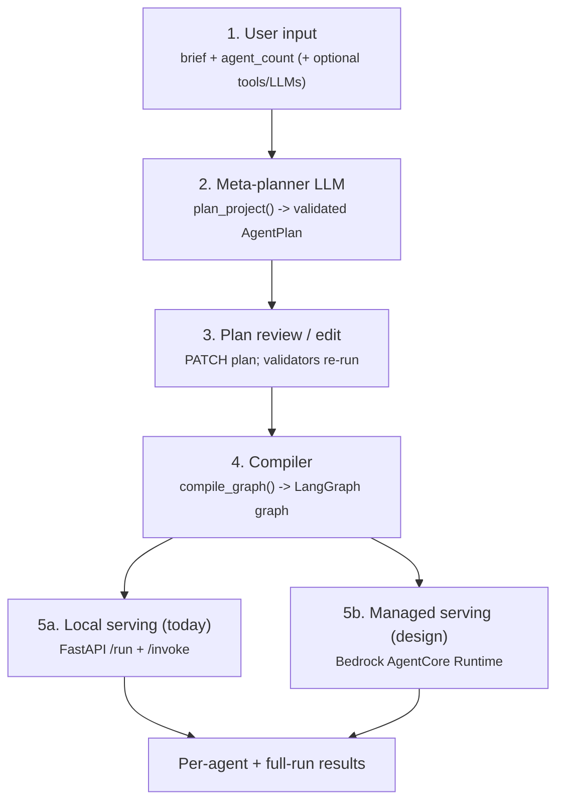
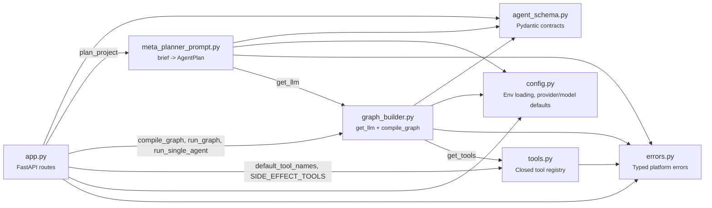
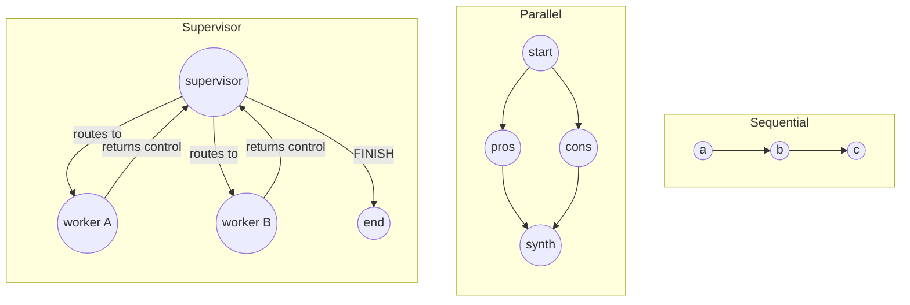
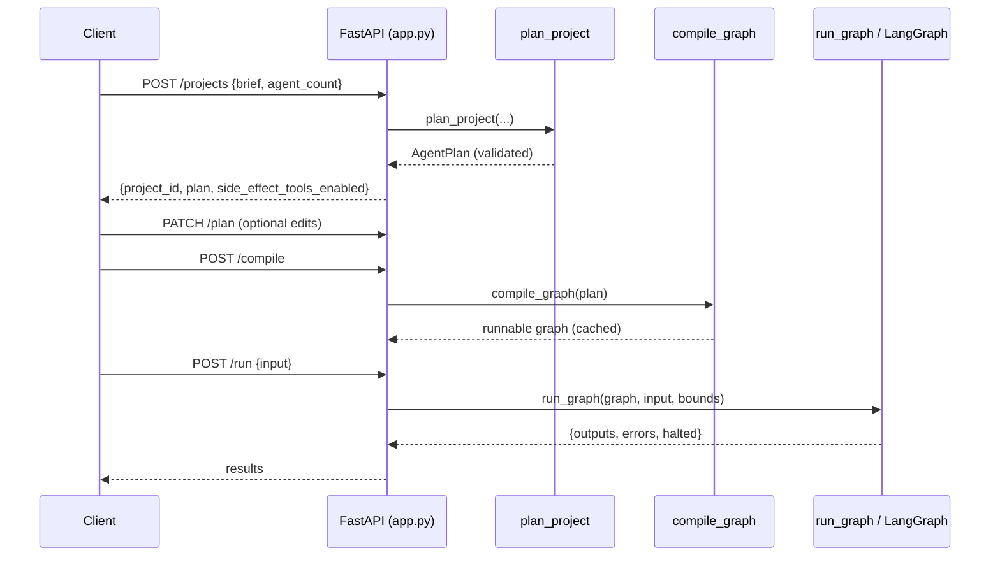
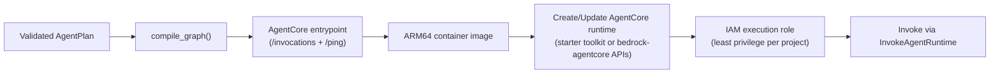

# System Description — Agentic Platform

This is the single deep-reference doc for this codebase: how a natural-language brief
becomes a live, callable multi-agent system, why each piece of the stack exists, and how
the system is served both today (local FastAPI) and in its production design (Amazon
Bedrock AgentCore Runtime). Read this end to end and the whole architecture should make
sense without reading the source first — the source is where you go to verify a detail,
not to discover the shape of the system.

This document describes what is **actually built and tested** in the code, and is
explicit about what's still just a design (see §12, "Current status").

> Companion docs: [README.md](../README.md) (product pitch + quick start), `CLAUDE.md`
> (the operating contract new work must follow), `SYSTEM_PROMPT.md` (the original
> builder brief this project was scoped from).

---

## 1. The five stages at a glance



| Stage | Entry point | Produces | Never does |
|---|---|---|---|
| 1. Input | `POST /projects` | a `CreateProjectRequest` | trust the text as safe |
| 2. Plan | `plan_project()` | a validated `AgentPlan` | talk to infrastructure |
| 3. Edit | `PATCH /projects/{id}/plan` | a re-validated `AgentPlan` | accept invalid edits |
| 4. Compile | `compile_graph()` | a runnable LangGraph graph | call an LLM for planning |
| 5. Serve | FastAPI / AgentCore | agent outputs + errors | execute model-generated code |

**Boundary invariant:** the planner never talks to infrastructure; the compiler never
calls an LLM for planning decisions. The LLM emits only structured *configuration*
(`AgentPlan`), and a fixed compiler interprets it — model output is never executed as code.

---

## 2. Module map

Which file talks to which — useful before reading any single file, so an import doesn't
look like a surprise. Everything below lives in `backend/src/agentic_platform/`, an
installed package (`uv sync` from `backend/`), so tests and scripts import
`agentic_platform.*` rather than manipulating `sys.path`. Within the package, imports are
relative (`from .config import`), so the package stays relocatable. The console is a
separate project in `frontend/` with its own dependencies — see §8.



`agent_schema.py` is deliberately a leaf: it imports nothing else in this project, so the
data contracts never depend on infrastructure, tools, or LLM clients — everything else
depends on it, never the reverse.

---

## 3. Data contracts (`agent_schema.py`)

Everything downstream keys off these Pydantic models. This is the single source of truth
for what a plan is allowed to be.

- **`LLMConfig`** — `provider` (one of `openai | anthropic | google_genai | groq |
  moonshot | ollama`), `model`, `temperature`, and `extra_params` (the escape hatch for
  provider quirks, e.g. Moonshot Kimi's reasoning/sampling params — never a bespoke field
  per provider).
- **`AgentSpec`** — `id`, `role`, `system_prompt`, `llm: LLMConfig`, `tools: list[str]`,
  `depends_on: list[str]`, `output_schema` (forward-compat hook, default `"default"`).
  `id`/`role`/`system_prompt` are validated non-blank.
- **`AgentOutput`** — `content: str` + `data: dict` — the one structured shape every
  compiled agent node returns.
- **`RunBounds`** — `max_steps` (8), `timeout_s` (300.0, whole-graph wall clock),
  `max_retries` (3). Every run is bounded by these, not by model good behavior.
- **`AgentPlan`** — `agents`, `orchestration_pattern` (`sequential | parallel |
  supervisor`), `supervisor_id` (only for supervisor), `bounds`.

**`AgentPlan`'s model validator (`_validate_graph`) enforces, at parse time:**
1. at least one agent;
2. unique agent ids (no duplicates);
3. no agent depends on itself; every `depends_on` id is a known agent;
4. sequential/parallel plans are acyclic (`_assert_acyclic`, DFS cycle detection);
5. supervisor plans set `supervisor_id` to a real agent and have ≥1 worker besides it;
6. `supervisor_id` is set **only** for the supervisor pattern.

Because these run on parse, an invalid plan is rejected the moment it's constructed —
including on a plan edit (`PATCH`).

---

## 4. Stage 2 — planning (`meta_planner_prompt.py`)

`plan_project(user_brief, requested_agent_count, available_tools?, available_llms?,
planner_llm?)` is the only component that turns free text into a plan.

Flow:

1. Defaults resolve: `available_tools` → `default_tool_names()` (every registered tool
   *except* ones flagged as side-effecting — see §7); `available_llms` →
   `[{DEFAULT_PROVIDER, DEFAULT_MODELS[...]}]`; `planner_llm` → default provider/model.
2. `get_llm(planner_llm)` builds the chat model; `.with_structured_output(AgentPlan)`
   forces structured output.
3. Retry loop up to `_PLANNER_RETRY_CEILING` (3), `_PLANNER_BACKOFF_S` (1.0s):
   - build system + user messages (`_build_user_message` injects task, count, allowed
     tool names, allowed LLM options, and — on retry — the previous rejection reason);
   - `structured.invoke(messages)` → candidate `AgentPlan` (schema validators run here);
   - `_semantic_check(...)` re-validates server-side that every agent's tools are a
     subset of the allowed set and every `(provider, model)` is one of the allowed
     options (constraints the schema alone can't express);
   - on `ValidationError | ValueError`, capture the error text, feed it back as the
     `correction` on the next attempt (the same error-recovery loop applied to the
     planner itself).
4. On success, return the `AgentPlan`. On ceiling exhaustion, raise **`PlannerError`**
   (`attempts`, `last_error`).

**Key point:** the model's own claim that its output is well-formed is never trusted —
the plan is re-validated (schema + semantic) server-side before it can be compiled.

**Because a side-effecting tool (`web_search`) is excluded from the planner's default
allow-list, the planner can never route a project to it unless a caller explicitly names
it in `available_tools` at project-creation time — that explicit naming *is* the
per-project opt-in required by the security model (§10).**

---

## 5. Stage 4 — compilation (`graph_builder.py`)

`compile_graph(plan)` dispatches on `orchestration_pattern`. First it fails fast: for
every agent it calls `get_tools(spec.tools)` so an unknown tool name, or a side-effect
tool missing its API key, is caught at compile time, not mid-run.

### 5.1 The LLM factory — `get_llm(config)`

The single point where a provider string becomes a `BaseChatModel`. Adding a provider
means adding a branch here (and a `config.py` entry) — never touching the compiler or
the planner.

| Provider | Wiring |
|---|---|
| `openai`, `anthropic`, `groq`, `ollama` | LangChain's native `init_chat_model` (`ollama` needs no key) |
| `google_genai` | `ChatGoogleGenerativeAI` directly — key resolved from `GOOGLE_API_KEY` *or* `GEMINI_API_KEY`, since both names are common |
| `moonshot` | `ChatOpenAI` pointed at `MOONSHOT_BASE_URL` (Moonshot's Kimi models are OpenAI-compatible but not a native `init_chat_model` provider); reasoning/sampling quirks pass through `LLMConfig.extra_params` |

Any other provider string → **`UnsupportedProviderError`**. A resolvable provider with no
key present in the environment → **`MissingProviderKeyError`**.

### 5.2 Graph state — `GraphState` (TypedDict)

Threaded through every compiled graph:
- `input: dict` — the task input;
- `outputs: dict` — merge reducer (`{**a, **b}`) so nodes don't clobber siblings;
- `errors: list[dict]` — `operator.add` reducer (append-only structured failures);
- `halted: bool` — `operator.or_` reducer (any branch can flag failure without a write
  conflict; short-circuits the remaining sequential chain);
- `next_agent: str`, `supervisor_steps: int` — supervisor-only.

`initial_state(task_input)` seeds all of these.

### 5.3 The agent node — `_make_node(spec, bounds, include_all_outputs=False)`

Every worker node does the same thing, regardless of orchestration pattern:

1. **Dependency gating:** if any `depends_on` id is missing from `outputs`, skip and
   record a structured skip (`AgentExecutionError`, `attempts=0`) + set `halted`.
2. Build base messages: system prompt + `_build_context(...)` (task input plus the
   relevant prior outputs — declared deps normally, or *all* outputs for supervisor
   workers, which carry no `depends_on` wiring).
3. **Per-agent retry loop** up to `bounds.max_retries`:
   - on retry, append the actual previous error to this agent's own context (not a
     generic "try again");
   - `_run_agent_once(...)`: bounded tool loop (`bind_tools`, up to `max_steps`
     iterations, resolving tool calls via the validated tool map), then
     `.with_structured_output(AgentOutput).invoke(...)` for the final answer;
   - success → return `{"outputs": {spec.id: output}}`;
   - failure (tool error or schema-validation failure) → capture error, backoff
     (`_NODE_BACKOFF_S`), retry.
4. Ceiling exhausted → record a structured **`AgentExecutionError`** in `errors` and set
   `halted` — never raise, so one agent's failure never crashes the whole run.

### 5.4 The three patterns



- **Sequential (`_compile_sequential`)** — `_topological_order` sorts by `depends_on`
  (stable, preserving planner order among ready nodes); nodes chain START→…→END with
  conditional edges that route to END the moment `halted` is set.
- **Parallel (`_compile_parallel`)** — wires the real dependency DAG: agents with no deps
  fan out from START and run concurrently; agents with deps run once their deps complete
  (the merge/synthesis step). Failure is isolated per branch via node dependency gating —
  an independent worker failing does not stop its siblings; a merge node with a missing
  dependency is skipped.
- **Supervisor (`_compile_supervisor` + `_make_supervisor`)** — a router node emits a
  structured `_SupervisorDecision` (`next_agent` id or `"FINISH"`) each turn; control
  returns to the router after each worker; bounded by `cap = max(max_steps, 2*workers+2)`.
  An invalid routing target is coerced to `FINISH` (no infinite loop); a router failure
  ends the run cleanly with a recorded error.

### 5.5 Running a compiled graph

- `run_graph(graph, task_input, bounds)` — invokes the graph on a worker thread with a
  `recursion_limit` and enforces `bounds.timeout_s` as a hard wall clock (raising
  `TimeoutError` past it).
- `run_single_agent(plan, agent_id, task_input, upstream_outputs?)` — runs one node in
  isolation for the per-agent endpoint, letting the caller supply the upstream outputs the
  node's `depends_on` would normally provide.

---

## 6. Tools (`tools.py`)

Closed, vetted registry — agents select tools by name; nothing in the compiler or graph
nodes ever grants implicit network, filesystem, or shell access.

`TOOL_REGISTRY: dict[str, Callable[[], BaseTool]]` maps each name to a **factory**, not a
pre-built instance. This matters: importing `tools.py` (which happens at app startup and
in every test) never fails just because an API key for one tool is missing — only
*resolving that specific tool* does, exactly mirroring `get_llm`'s `_require_key` pattern
for LLM providers.

| Tool | Side effect? | Backing | Key required |
|---|---|---|---|
| `lookup` | No | Fixed 3-fact offline table | None |
| `calculator` | No | Pure-Python AST-restricted arithmetic evaluator | None |
| `web_search` | Yes | Tavily (`langchain-tavily`, `TavilySearch`) | `TAVILY_API_KEY` |
| `wikipedia` | Yes | Wikipedia search API + REST summary endpoint | None |
| `arxiv` | Yes | arxiv.org Atom export API (`export.arxiv.org/api/query`) | None |
| `pubmed` | Yes | NCBI E-utilities (`esearch` + `esummary`) | None (`PUBMED_API_KEY` optional, raises rate limit) |
| `weather` | Yes | Open-Meteo geocoding + forecast API | None |
| `yahoo_finance_news` | Yes | `yfinance`'s `Ticker(...).news` | None |
| `wolfram_alpha` | Yes | Wolfram\|Alpha Short Answers API | `WOLFRAM_ALPHA_APPID` |

**Side effect means network egress to a third party, not "needs a key."** `wikipedia`,
`arxiv`, `pubmed`, `weather` and `yahoo_finance_news` need no credentials at all but
still leave the machine, so they carry the same opt-in requirement as the keyed ones.
Only `lookup` and `calculator` compute locally and are therefore available by default.

**Why these call REST APIs directly rather than using `langchain-community`.** That
package was archived (read-only, no future fixes) in 2026. Its Wikipedia integration is
already broken — the `wikipedia` PyPI package it depends on, unmaintained since ~2016,
fails against Wikipedia's current API and can't be fixed by configuration — and its Arxiv
integration only works if `arxiv` is pinned below 3.0 because of an upstream API change.
None of these five ever got a maintained standalone package the way Tavily did
(`langchain-tavily`). Calling each service's documented, stable endpoint with `requests`
is both less code and less exposure to a frozen dependency.

**Calculator safety.** The expression is parsed with `ast.parse(..., mode="eval")` and
walked by `_eval_arithmetic`, which permits only numeric constants, parentheses, and
`+ - * / // % **`. Names, calls, attributes and subscripts raise before anything is
evaluated, so `__import__('os').system(...)` is rejected at the AST level rather than
executed. `eval()` is never called on model- or user-supplied text.

`get_tools(names)` resolves names against the registry (raising **`UnknownToolError`**,
naming every unresolved name, not just the first) and calls each factory. A side-effect
tool with no key raises **`MissingToolKeyError`** at resolution time — which, because
`compile_graph` resolves every agent's tools before building the graph, means a
misconfigured project fails clearly at compile time, not mid-run.

**Opt-in enforcement.** `SIDE_EFFECT_TOOLS` marks which registry entries have real-world
side effects. `default_tool_names()` returns the registry minus that set, and
`app.py::create_project` uses it as the default `available_tools` — so a project that
doesn't explicitly ask for `web_search` never sees it in its planner's allowed-tool list,
and the planner (§4) therefore can never route to it. Naming `web_search` explicitly in a
project's `available_tools` at creation time *is* the opt-in; the platform records which
side-effect tools were enabled per project (`side_effect_tools_enabled`) and returns that
on both project creation and lookup, so opt-in is auditable, not just silently enforced.

---

## 7. Errors (`errors.py`) and how they surface

All typed errors extend `PlatformError`, letting the API map each to a stable JSON shape
(`{error_type, message, details}`) with one handler per type — clients never see a raw
stack trace or a secret value.

| Error | Raised when | API status |
|---|---|---|
| `UnknownToolError` | agent references a tool not in the registry | 400 |
| `UnsupportedProviderError` | `get_llm` gets an unknown provider | 400 |
| `MissingProviderKeyError` | no env key for an LLM provider (server misconfig) | 500 |
| `MissingToolKeyError` | no env key for a side-effecting tool (server misconfig) | 500 |
| `PlannerError` | planner can't produce a valid plan within the ceiling | 422 |
| `AgentExecutionError` | an agent node exhausts retries or is skipped | carried in `errors[]`, not raised |
| `ValidationError` (pydantic) | invalid plan/request | 422 |
| `PlatformError` (base) | any other typed platform failure | 400 |

`AgentExecutionError` is deliberately *carried in graph state* (`to_dict()` →
`{agent_id, error, attempts}`) rather than raised, so a supervisor node or the deployment
layer can react instead of the whole run collapsing.

---

## 8. Stage 5a — local serving (`app.py`, MVP)

FastAPI app, in-memory stores keyed by project id (`_PROJECTS`, `_COMPILED`) so the later
move to Postgres/Redis and multi-tenancy is additive, not a rewrite.

| Route | Purpose |
|---|---|
| `GET /health` | liveness |
| `GET /tools` | the tool registry, each entry flagged `side_effect`, plus the default (opt-in-free) set |
| `GET /providers` | selectable provider/model pairs, with the platform default marked |
| `POST /projects` | brief → `plan_project` → store plan, return `project_id` + plan + `side_effect_tools_enabled` |
| `GET /projects/{id}` | fetch brief + plan + `compiled` flag + `side_effect_tools_enabled` |
| `PATCH /projects/{id}/plan` | replace plan (validators re-run); invalidates stale compiled graph |
| `POST /projects/{id}/compile` | `compile_graph(plan)` → cache in `_COMPILED` |
| `POST /projects/{id}/run` | `run_graph(...)` → `{outputs, errors, halted}` |
| `POST /projects/{id}/agents/{agent_id}/invoke` | `run_single_agent(...)`; unknown agent → 404 |

### Local request lifecycle (full run)



### The web console (`frontend/`)

A React + Vite single-page app that drives the API above — the operator-facing surface for
the same five stages. It is a *client* of the platform, not part of it: it holds no
business logic, and every rule it appears to enforce is really enforced server-side.

| Concern | Where it lives |
|---|---|
| API calls + typed error normalisation | `frontend/src/lib/api.js` — every failure becomes an `ApiError` carrying the backend's `{error_type, message, details}` |
| Stage state machine | `frontend/src/App.jsx` — brief → plan → compiled → result, with one busy flag per concern so a slow run doesn't freeze the console |
| Brief, agent count, model, tool opt-in | `frontend/src/components/DefinePanel.jsx` |
| Plan review + raw JSON editing | `frontend/src/components/PlanPanel.jsx` (a plan edit clears the compiled flag, mirroring the server's cache invalidation) |
| Full-graph and single-agent execution | `frontend/src/components/RunPanel.jsx` |

The tool picker seeds itself from `GET /tools`'s `default` list, so it opens showing
exactly the tools the API would use if `available_tools` were omitted — the opt-in posture
is visible rather than hidden. Ticking a `side_effect` tool surfaces an explicit
"external access opted in" warning naming the services involved.

In development the console runs on Vite's port 5173 and proxies `/api` to port 8000, so
the browser stays on one origin; `app.py` also carries a CORS allow-list scoped to those
localhost dev ports for direct (unproxied) calls.

---

## 9. Stage 5b — managed serving on Amazon Bedrock AgentCore (design)

**Not yet implemented** — this is the serving target the compiled graph is designed to be
promoted to, not code that exists today. Recorded here so the eventual implementation has
a single design to follow rather than inventing the contract from scratch.

### 9.1 The runtime contract

An AgentCore agent is a container that must:
- expose **`POST /invocations`** — primary entrypoint; JSON task input in, result out
  (streaming supported);
- expose **`GET /ping`** — health check;
- be built for **ARM64**.

Clients invoke it through the **`InvokeAgentRuntime`** API. The contract is implemented
either via the `bedrock-agentcore` Python SDK's `@entrypoint` decorator (starter toolkit,
which handles the HTTP server details) or by implementing the two endpoints directly.

### 9.2 What the deployment layer would wrap

The AgentCore entrypoint is designed as a thin adapter over the same functions the
FastAPI layer already uses — no compiler or runtime code changes, only the serving
envelope differs:

```
POST /invocations  ->  compile_graph(plan) [or cached graph]  ->  run_graph(graph, payload.input, plan.bounds)
GET  /ping          ->  health/readiness
```

The JSON task-input contract is the same one `POST /run` accepts locally, so a graph
would run identically both ways.

### 9.3 Deploy flow (design)



### 9.4 Project → runtime mapping (open decision)

AgentCore hosts one agent per deployed artifact, so a project maps to a runtime one of
two ways:

| Option | Isolation | Cost of deploys | Fits |
|---|---|---|---|
| **Runtime-per-project** | Strong (own runtime + role) | One deploy per project | The "promote a tenant to dedicated infra" principle; heavy/compliance tenants |
| **Shared runtime, in-payload routing** | Weaker (shared runtime, dispatch by project id) | Few deploys | Many small/early tenants |

A common path: shared runtime early, promote heavy or sensitive tenants to dedicated
runtimes later — the architecture allows this without a rewrite.

### 9.5 Secrets and isolation (design)

BYOK provider keys would go through KMS / Secrets Manager (or AgentCore Identity),
decrypted only in-memory at call time — never baked into the image, never logged, never
stored on a plan object. Each deployed project would run in an isolated AgentCore runtime
session, so one tenant's execution state, memory, and credentials never bleed into
another's.

---

## 10. Technology stack

| Layer | Choice | Status |
|---|---|---|
| Agent orchestration | LangGraph | **In use** |
| Agent / tool abstraction | LangChain | **In use** |
| API layer | FastAPI | **In use** |
| Web console | React + Vite | **In use** (`frontend/`) |
| Primary datastore | PostgreSQL | Planned (in-memory dicts today) |
| Cache / queue | Redis | Planned |
| Background workers | Celery / RQ | Planned |
| Observability | LangSmith (or equivalent) | Planned |
| Deployment / serving (managed) | Amazon Bedrock AgentCore Runtime | Planned (design in §9) |
| Isolation (scale-up path) | Dedicated AgentCore runtime per tenant | Planned |
| Secrets management | KMS-backed encryption + AgentCore Identity / Secrets Manager | Planned (server env vars today) |

---

## 11. Why each dependency

Every entry in `pyproject.toml`, with what it's *for*, how this code actually uses it,
and why the system would be materially worse without it — not just "it's a common
library."

| Package | Why it's here | How this codebase uses it | Why it's specifically required |
|---|---|---|---|
| **langchain** | Gives one abstraction (`BaseChatModel`, `BaseTool`, `with_structured_output`, `bind_tools`) over every LLM provider and every tool. | `graph_builder.py`'s `get_llm` returns a `BaseChatModel` regardless of provider; `_run_agent_once` calls `.bind_tools()` / `.with_structured_output()` on whatever model comes back; `tools.py` builds every tool with the `@tool` decorator / `BaseTool` interface. | This is the mechanism behind non-negotiable principle #2 (multi-provider support behind one interface). Without it, every provider would need its own request/response parsing and its own tool-calling schema, and adding a provider would mean touching the compiler, not just `get_llm`. |
| **langgraph** | A stateful graph runtime with cycles, conditional edges, and per-key state reducers. | `graph_builder.py`'s `StateGraph`, `START`/`END`, `add_conditional_edges`, and the `Annotated[...]` reducers on `GraphState` (`operator.add`, `operator.or_`, the outputs merge lambda) are all LangGraph primitives; the supervisor pattern's routing loop is a real cycle in the graph. | The supervisor pattern needs a genuine loop (route → run worker → route again) and the parallel pattern needs concurrent branches that merge into shared state without clobbering each other. Plain LangChain chains (linear pipelines) can't express either; hand-rolling a scheduler with concurrency-safe state merging would be reimplementing LangGraph's job. |
| **langchain-openai** | The `ChatOpenAI` client, for OpenAI itself and for any OpenAI-compatible endpoint. | Used twice in `get_llm`: once implicitly via `init_chat_model` for the native `openai` provider, and once explicitly, constructing `ChatOpenAI(base_url=MOONSHOT_BASE_URL, ...)` for Moonshot. | Moonshot's Kimi models are OpenAI-API-compatible but aren't a native `init_chat_model` provider string — `ChatOpenAI` pointed at a different `base_url` is the standard way to wire an OpenAI-compatible endpoint into LangChain without writing a bespoke HTTP client. |
| **langchain-google-genai** | The `ChatGoogleGenerativeAI` client for the `google_genai` provider. | `get_llm` constructs it directly (rather than via `init_chat_model`) so it can resolve the API key from either `GOOGLE_API_KEY` or `GEMINI_API_KEY` — both names are common in the wild. It's also `config.py`'s `DEFAULT_PROVIDER`, so it's what the planner and the FastAPI defaults use when a request doesn't name a model. | Needed as a first-class native provider for the multi-provider factory; handled explicitly (not through `init_chat_model`) specifically to support the two-env-var-name key lookup, which `_require_key` in `graph_builder.py` implements. |
| **langchain-tavily** | `TavilySearch`, a structured web-search tool. | `tools.py`'s `_build_web_search()` constructs it lazily (only when the `web_search` tool is actually resolved) and returns it from `TOOL_REGISTRY`. | This is the platform's first tool with a real-world side effect (network egress to a third party) — it's what makes the tool registry more than a proof of concept, and it exists specifically to exercise (and require) the opt-in enforcement described in §6. Chosen over a keyless option (e.g. DuckDuckGo) because it returns structured JSON results suited to agent consumption and is a first-party LangChain integration, matching the project's "boring, well-supported infra" preference over exotic scraping. |
| **requests** | A plain, synchronous HTTP client. | `tools.py` — every hand-rolled network tool (`wikipedia`, `arxiv`, `pubmed`, `weather`, `wolfram_alpha`) calls its service's REST endpoint through it, with a shared `User-Agent` header and a 10-second timeout. | The alternative to one small HTTP client is a separate wrapper library per service — which is exactly the `langchain-community` dependency this codebase deliberately avoids (§6). Synchronous is correct here: tool calls already run inside a worker thread bounded by `RunBounds.timeout_s`, so there's no event loop to block. |
| **yfinance** | A maintained client for Yahoo Finance's data endpoints. | `tools.py`'s `yahoo_finance_news` tool calls `yfinance.Ticker(symbol).news` and formats the headlines. | Yahoo has no official public news API, so any integration is best-effort against an undocumented endpoint; `yfinance` is the actively-maintained library that tracks Yahoo's changes, and it's what the archived `langchain-community` tool depended on anyway — using it directly removes a dead middleman rather than adding risk. |
| **fastapi** | The API layer: async routes, request/response validation from Pydantic models, auto-generated OpenAPI docs, typed exception handlers. | `app.py` — every route (`/projects`, `/compile`, `/run`, `/invoke`, …), the `CreateProjectRequest`/`RunRequest`/`AgentInvokeRequest` models, and one `@app.exception_handler` per typed `PlatformError` subclass. | CLAUDE.md requires OpenAPI docs as "a real deliverable," which FastAPI generates for free from the same Pydantic models already used for the `AgentPlan` contract — no separate API-schema definition to keep in sync. |
| **uvicorn[standard]** | The ASGI server that actually runs the FastAPI app; `[standard]` pulls in the faster/optional extras (`httptools`, `watchfiles`, etc.) used for local `--reload` dev. | Invoked directly: `uv run uvicorn agentic_platform.app:app --reload` (see README). | FastAPI defines routes; it doesn't listen on a socket. Something has to actually serve HTTP, and uvicorn is the reference ASGI server the FastAPI docs themselves recommend. |
| **pydantic** | The schema/validation layer behind every structured contract in the system. | `agent_schema.py`'s `BaseModel`s (`LLMConfig`, `AgentSpec`, `AgentOutput`, `RunBounds`, `AgentPlan`) with `field_validator`/`model_validator` for the graph-integrity checks in §3; every FastAPI request/response model. | This is the concrete mechanism behind non-negotiable principle #3 (structured output everywhere) and #7 (never trust the model's own claim of well-formedness) — `with_structured_output(AgentPlan)` and the re-validation in `_semantic_check` both depend on `AgentPlan` being a real Pydantic model, not a loosely-typed dict. |
| **python-dotenv** | Loads a local `.env` file into `os.environ`. | `config.py` calls `load_dotenv()` once at import, so every module's `os.environ.get(...)` (provider keys, `TAVILY_API_KEY`) sees the same environment without each module reimplementing env loading. | Pure local-dev convenience — lets contributors keep keys in a gitignored `.env` instead of exporting them in every shell session — with zero effect on production, where real env vars/secrets managers are used instead. |
| **pytest** *(dev)* | The test runner for the entire suite. | Every file under `backend/tests/`. `backend/pyproject.toml`'s `[tool.pytest.ini_options]` defines the `e2e` marker and excludes it by default (`addopts = "-m 'not e2e'"`), so the default `uv run pytest` never makes a real network/LLM call. | The project's verify-and-retry working style (CLAUDE.md) depends on a fast, fully offline, repeatable test suite — 40 tests run in a few seconds precisely because nothing here needs a real API key. |
| **pytest-asyncio** *(dev)* | Lets pytest run `async def` test functions and sets the asyncio mode. | `asyncio_mode = "auto"` in `pyproject.toml`; enables async test support for the FastAPI/httpx-based tests. | FastAPI is an async framework; without this, async endpoints and async test clients would need manual event-loop plumbing in every test. |
| **httpx** *(dev)* | The HTTP client `fastapi.testclient.TestClient` is built on. | Used implicitly by `TestClient(app_module.app)` in `backend/tests/test_api.py` and `backend/scripts/smoke_e2e.py` — every simulated request to the FastAPI app goes through it. | Lets tests and the smoke script call the real FastAPI app in-process (real routing, real validation, real exception handlers) without binding a socket or running a separate server process. |

---

## 12. Cross-cutting invariants (hold at every stage)

1. **Config, not code.** The LLM emits only `AgentPlan`; a fixed compiler interprets it —
   no model-generated code is ever executed.
2. **Structured output at every component boundary** — the plan, each agent's output, the
   supervisor's routing decision. Free-text parsing between components is a bug.
3. **Every run is bounded** — `max_steps`, `timeout_s`, `max_retries`, and the supervisor
   iteration cap — enforced by the platform.
4. **Error recovery is local and informative** — feed the actual error back into the
   failing unit's own context and retry to a ceiling; then record a structured failure
   instead of crashing the run. This applies to the planner and to every agent node.
5. **Untrusted input, always** — natural language *and* planner output are re-validated
   server-side (schema + semantic) before compilation or execution.
6. **One uniform error surface** — every failure is a typed `PlatformError` mapped to a
   stable JSON shape; clients never see raw stack traces or secret values.
7. **Multi-tenancy from day one** — every resource keyed by project id, so persistence,
   auth, and per-project AgentCore runtimes are additive.
8. **Side-effecting tools are opt-in, never auto-attached** — the planner's default
   allow-list excludes them; a caller must name one explicitly per project (§6).

---

## 13. Current status

**Built and verified today** (40-test offline suite passing, plus a real-API smoke script
covering all three orchestration patterns and the real `web_search` tool):
- Data contracts and graph-integrity validation (`agent_schema.py`)
- Meta-planner with retry-on-validation-error (`meta_planner_prompt.py`)
- Compiler for all three orchestration patterns, with per-agent error recovery
  (`graph_builder.py`)
- Tool registry with nine tools — two local (`lookup`, `calculator`) and seven
  opt-in networked ones (`web_search`, `wikipedia`, `arxiv`, `pubmed`, `weather`,
  `yahoo_finance_news`, `wolfram_alpha`) — with enforced default exclusion of every
  side-effecting tool (`tools.py`)
- FastAPI local serving layer with typed error responses (`app.py`)
- React + Vite web console covering the full brief → plan → compile → run loop
  (`frontend/`), verified against the live API in a browser

**Not yet built** (design recorded above, not code):
- Bedrock AgentCore deployment layer (§9) — entrypoint adapter, container build, runtime
  create/update, IAM role.
- Persistence (Postgres/Redis) — `_PROJECTS`/`_COMPILED` are in-memory dicts today.
- Async background compilation/execution (Celery/RQ).
- Per-project API keys, auth, rate limiting, budget caps.
- KMS-backed BYOK secret storage (keys come from server env/`.env` today).
- Observability (LangSmith / AgentCore Observability) wiring.
- Dedicated synthesis/aggregator endpoint (currently `/run` returns the raw outputs map).
- Tools requiring per-project credentials/OAuth (Gmail, Slack, GitHub, Jira, SQL) — these
  need a credential-management layer that doesn't exist yet, not just registry entries.
